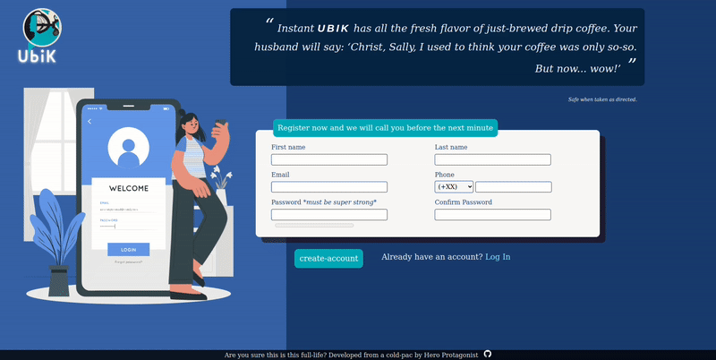

 
<h1>A Sign Up form</h1>
<h2><em>Typers typing</em></h2>

 

## Features 
- Form validates using web-native HTML5 [Constrain Validation API](https://developer.mozilla.org/en-US/docs/Web/HTML/Constraint_validation)
- Followed [Forms guidelines](https://www.nngroup.com/articles/errors-forms-design-guidelines/) for correct UX

## Valuable things I learned
- Do not underestimate any proyect
- Plan ahead the fundamental building blocks of the proyect, even for <i>small proyect like this one</i>. As they say, the more you plan the least you work.
- Useful usage of css functions and selectors.
- Do not overcomplicate the layout

## Could be improve
- Make use of the styling classes like ::valid ::invalid

## Things I notice along the way
- HTML fundamental structure should have been a simple header, main, footer instead of dividing the whole page in 2. The light-blue/blue background could have been recreated via a linear-gradient, this way would have been more easy to make the site responsive for medium/small screen devices and overall easier to understand html structure. I thought of remaking the whole html/css for that but the proyect isn't original enough to make it worth it.

## To-do
- media queries for small scren devices
- To-don't, but was an idea: to make a 'cold-pack revelation' animation when clicking the 'ubik' word, and making the elixir of ubiquity old store man appears  
